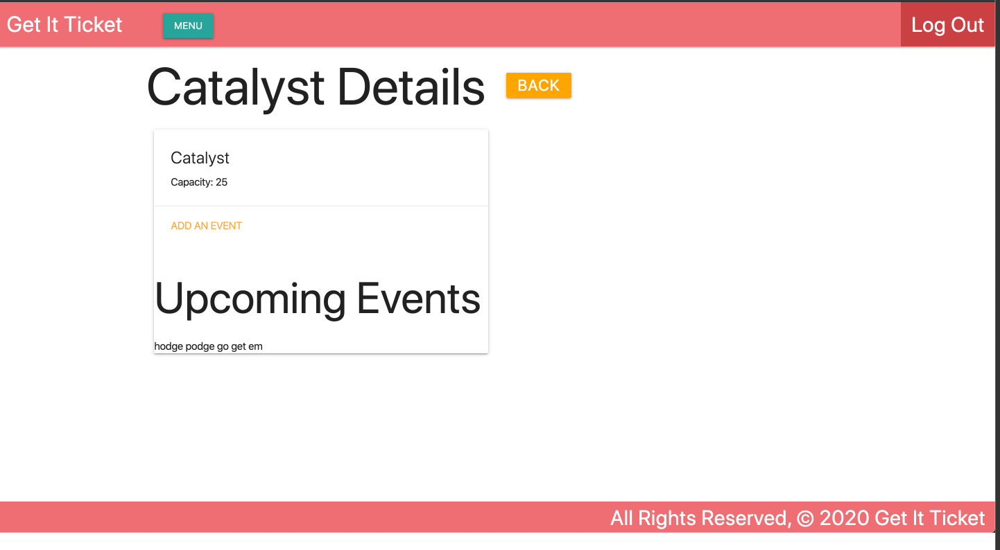

## GET IT TICKET ##

### Developed Using ###

 + Python Django Framework
 + HTML
 + CSS

 ### About ###

Get It Ticket is a fully integrated platform connecting businesses and venues directly to event goers. The platform allows business administrators to mange their business profiles: managing venues, events, and tickets.

Customers have the ability to: customize a profile, view a list of upcoming events, purchase tickets for those events, and offer no longer wanted tickets to others- if accepted the customer transfers finacial responsiblity to the new customer.

## Getting Started ##

The home page displays all upcoming events

First a user logins in as either a customer, admin for a business, or both.

The following outlines site navigation for an admin user.

If the current user doesn't have an existing profile, they can simply click the signup form to join.

Onced logged in the user has access to unique options in the menu bar. In the following example the user has administration privileges and can manage their associated business by clicking the link.

By clicking the Add A Business button the admin can create another business to administer

By clicking the manage button, the admin will be taken to the detail page for that specific busniss entity. There the admin can add and delete venues.

Clicking delete, deletes the venue and returns to the same business admin page.

Clicking view venue details, takes the admin to the detail page for the venue where they can add events.

Clicking the add event link directs the admin to the event creation form.

The newly created event will display on the homepage in the list of upcoming events sorted by event date.

### This completes the current user experience for a user with administrative privileges ###

## Visit Get It Ticket ##

[click here]()

## Looking Ahead ##

Future feature releases include the following:

 + The customer experience 
    right now site functionality pertains solely to the administrators of businesses. Coming soon will be all of the above mentioned customer functionality.
    +  profile creation
    +  ticket purhcase
    +  ticket resale
+ Further administator functionality 
    + update/delete business
    + update/delete events
    + create/update/delete tickets

[click here](https://trello.com/b/OLK8h098/project-3) to see the project outline

Considering an investment in the furture of Get It Ticket?
[click here](https://docs.google.com/presentation/d/1-xNMen5sec_vtIxDnHCOFc-dyG26UjPlSITpUQhCVa8/edit?usp=sharing) for our elevator pitch

